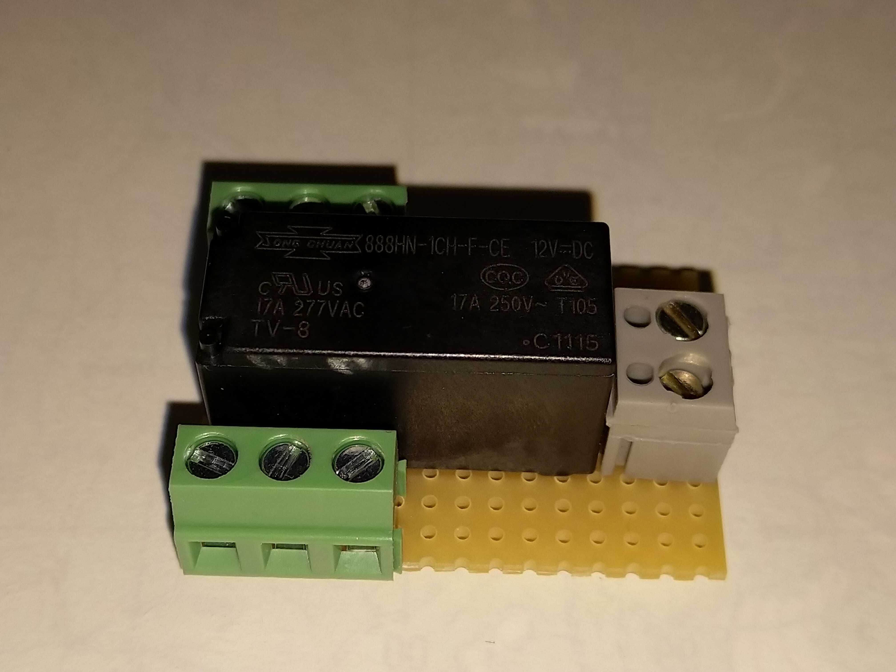

# Großer Laser Cutter (GLC)
Hierbei handelt es sich um ein DIY-Projekt, dass von Paul K. ins Leben gerufen wurde. Ziel war es einen Laser Cutter mit großer Bearbeitungsfläche (1500mm x 1500mm) und leistungsstarkem CO2-Laser (150W) aufzubauen. Beim Aufbau wurde 'nachhaltig' vorgegangen, so kamen vermehrt Materialien zu Einsatz, die gebraucht waren oder gar vom Schrottplatz kamen.

Der DIY-Lasercutter entstand 'planfrei' über mehrere Jahre und es hat eine große Anzahl von Mitgliedern des Makerspace-Wiesbaden den Aufbau unterstützt. 
Folgende Teams waren maßgeblich beteiligt:
- Design und Aufbau Mechanik
Laser Cutter Team - vorwiegend montags aktiv - Paul K., Stonie, Brani, Klaus F.
- Elektrischer Aufbau, Zugangs-Controller, Sicherheits Controller
Technik Team - vorwiegend dienstags aktiv - Michael M., Klaus F., Elian T. und Dieter H.
- Abluft bzw. Absaugung
wird in Absprache mit den anderen Teams von Brani koordiniert

Die Teams haben über die Monate und Jahre sehr viel gelernt. Oft war die Enttäuschung groß, doch es wurde nicht aufgegeben und alternative Lösungswege gefunden.

Jetzt - Oktober 2020 - hat der GLC einen mechanisch stabilen Zustand erreicht und eine Nutzung rückt in die Nähe.
Allerdings sind noch notwendige Arbeiten an Elektrik und Elektronik auszuführen, um alle Sicherheitsaspekte zu erfüllen.

<h1>Control Lasercutter</h1>
Leider wurde der Aufbau vom GLC nicht dokumentiert, aus diesem Grund fehlt hier der Verlauf des Aufbaus über die letzten Jahre.
Das Technik Team jedoch hat seine Aktivitäten zu Verdrahtung, Zugangs-Controller, Sicherheits-Controller und Software Source Code gut dokumentiert und hier auf Github veröffentlicht. 
Dort findet ihr:

- [Bisherige Schaltbilder](doc/Schaltpläne_gr_LasercutterV5.pdf), d.h. letztendlich der momentane Zustand
- [Technik-Team Änderungsvorschlag - aktuell](doc/Schaltpläne_gr_LasercutterV6_2.pdf), dies sind die Änderungen, die wir zeitnah implementieren werden
- [RFID4Lasercutter](https://github.com/makerspace-wi/RFID4Lasercutter.git) - hier findet ihr den Sourcecode für den Zugangs-Controller

<h2>Notwendige Arbeiten am großen Laser Cutter</h2>
19.10.2020 
Am Dienstag den 13.10.2020 hat sich das Technik-Team die Angelegenheit angeschaut und festgestellt, dass noch einige sicherheitsrelevante Änderungen durchgefhrt werden müssen.

Der Technik-Vorstand hat festgelegt, dass keine Mitglieder für den GLC freigegeben werden dürfen, bis die im folgenden beschriebenen Änderungen ausgeführt sind.

		
<b>ACHTUNG - MOMENTAN sind die Sicherheitsschalter an den beiden Klappen NICHT verdrahtet!
Die NOT-AUS Schalter sollen/dürfen nicht zum Aus-/Einschalten des GLC genutzt werden!
Der Absauglüfter muss manuell vor dem LASERN nach Vorgabe eingeschaltet werden.
</b>

<h2>Vorschlag Technik Team zum Umbau des GLC</h2>

- Die 4 NOT-AUS Schalter - wenn ausgelöst - öffnen ein separates mechanisches Relais, dass die Ausgangsspannung der beiden Motornetzteilen unterbricht, die für die Achsensteuerung zuständig sind.

Desweiteren wird 'NOT-AUS' an den Controller gemeldet, der den Laser-Controller deaktiviert.
- der Stecker des GLC bleibt zukünftig immer in der Steckdose! Ein kleines Netzteil
versorgt ständig die GLC Zugangs- & Sicherheits Controller, die nur nach erfolgreichem ‘einloggen’ die Netzspannungen an alle Leistungsnetzteile anlegt und nur dann den CO2-Laser (Controller) aktiviert, wenn

		- die Sicherheitsschalter geschlossen sind
		- kein Not-Aus-Schalter aktiviert ist
		- die Rücklauftemperatur des Kühlwassers kleiner der Maximaltemperatur ist
		- die Flussgeschwindigkeit des Kühlwassers größer dem Grenzwert ist
		- und ein registriertes Mitglied eingeloggt ist

- Nach getaner Arbeit loggen sich die Mitglieder - wie bei den anderen Maschinen - wieder aus und alle Leistungsnetzteile werden vom Netz getrennt.

- Um die Absaugung zukünftig automatisiert einzuschalten, müssen diese vorher entsprechend umgebaut werden.

<h2>Thema Absaugung</h2>
Der momentane Absauglüfter hat einen Wechselstrommotor, dessen Drehzahl sich nicht einfach regeln läßt.
Dieser Absauglüfter ist extrem laut und hat schon zu Beschweden von Nachbarn geführt.
Momentane Behelfslösung vom Laser Cutter Team ist, den Lüfter ‘normal’ zu starten und dann mittels Phasenanschnittsteuerung die Versorgung so weit zu reduzieren, dass sich durch Eigenreibung die Drehzahl verringert.
Leider lässt sich dieser Prozess nicht automatisieren.

Das Technikteam hat dazu 2 Möglichkeiten evaluiert:

- einen elektronisch regelbaren	Wechselrichter besorgen und damit den Wechselstrommotor regeln - oder	
- bevorzugte Variante sind Lüfter mit Gleichstrommotoren (von Automobilradiatoren) einzusetzen, die mittels PWM auch elektronisch geregelt werden können. Diese Regelung ist bereits für den Kühlwasserlüfter in Betrieb.

Bei einer Diskussion mit Brani wurden wir uns einig, dass mehrere Lüfter im Absaugrohr installiert werden sollen. Wie schon oben erwähnt, will Brani diese Arbeiten koordinieren.

Testeintrag 26.10.2020